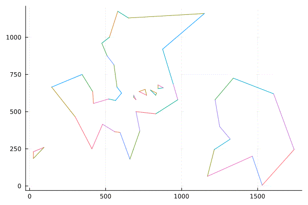
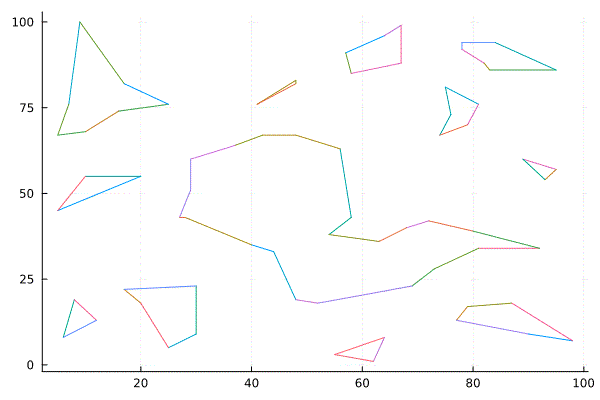
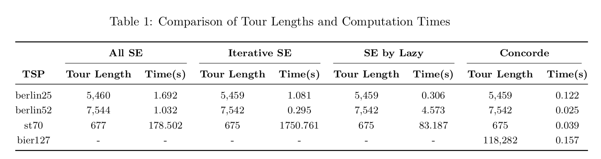
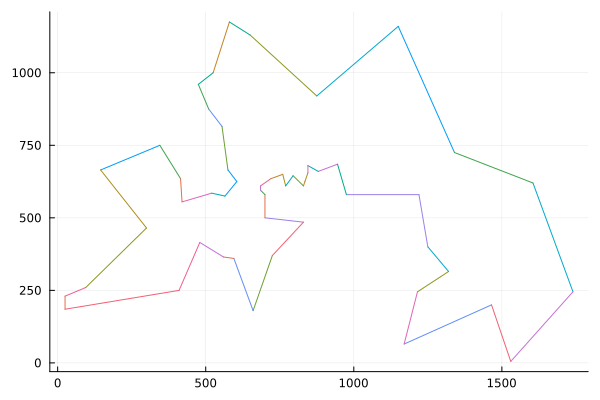
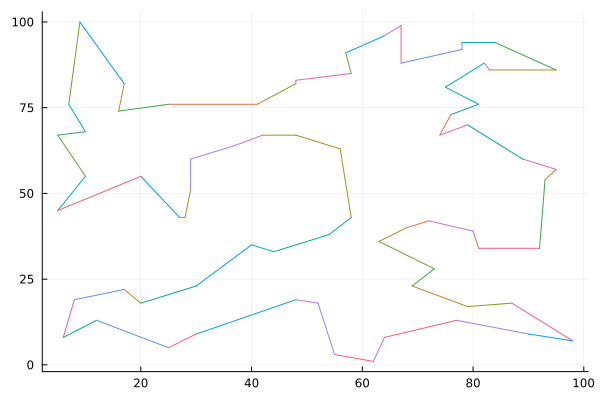

# Solving TSP with Lazy Constraints

The symmetric Traveling Salesman Problem (TSP) instances (such as berlin52.tsp, st70.tsp, etc.) were addressed using Lazy Constraints for subtour elimination. This was implemented through two different methods. 

## Experiments

In the experiments, it was confirmed that among all methods, using the Concorde solver resulted
in the fastest derivation of the optimal solution. Considering the time it took other methods to
solve st70.tsp, which consists of 70 nodes, it was evident why Concorde is considered an optimizer
tailored for TSP.
In the case of Iterative SE for berlin52.tsp, it operated faster than the lazy constraint approach,
leading to expectations of good performance on st70 as well. However, possibly due to the repetitive
nature of model optimization, it was observed that the speed significantly slows down once surpassing
a certain number of nodes.
Given that the problems we aim to solve must be of a realistic size, taking such factors into
account, the speed of the models can be ranked as follows: Concorde > SE by Lazy > All SE >
Iterative SE. For the remaining three models, excluding Concorde, the execution time was too long
for bier127 to be included in this report. Further experiments on this matter are planned, with the
intention to upload the table to the GitHub repository afterward.

## Code Explanation
In 'Iterative_SE.jl'(version 1), the code optimizes the TSP and checks if it's solved by using the Is_Tsp_Solved function. If the problem is solved, the objective value is printed, and the program exits. If not, constraints related to it are iteratively added at each step. The process of checking if it’s solved involves storing decision variables with x-values in cycle_idx, and if its length is less than the number of nodes, it indicates that a subtour still exists.

In 'SE_with_Lazy'(version 2), as opposed to version 1, a callback function is created within the solve_TSP_lazy function. This method utilizes the LazyConstraintCallback() approach on the model, which pre-informs the solver to execute callbacks via the callback function whenever a new Integer solution is found, during which it enforces @build constraints. The method for determining the presence of subtours within the callback function is structured the same as in version 1.

It can be considered that versions 1 and 2 essentially perform the callback operation in a similar manner. However, unlike version 1, which requires multiple executions of the model optimization, version 2 carries out the model optimization process only once. Thus, it can be inferred that the execution speed of version 1 will be slower than that of version 2.

### berlin52.tsp solution

### st70.tsp solution

If you want to create a plot for the TSP, you can use 'plot_generator.jl'. After that, you can generate a gif file through 'gif.py'.

## Acknowledgements
This repository includes adaptions of the following repositories as baselines:
* [tsp_lazy_template] 
https://gist.github.com/chkwon/d10d0dd3adbae8c145d680403ea1af18

* [TravelingSalesmanExact.jl]
https://github.com/ericphanson/TravelingSalesmanExact.jl